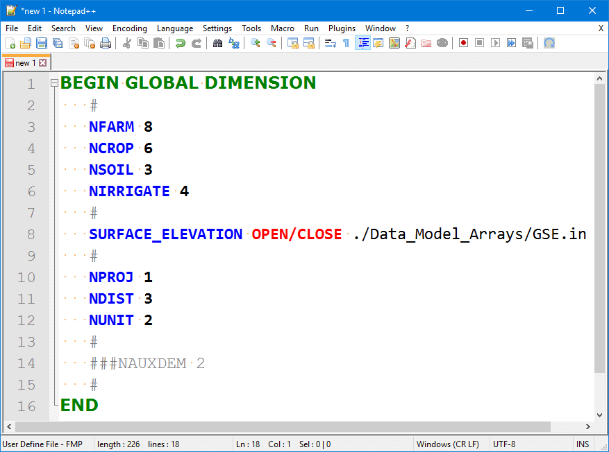
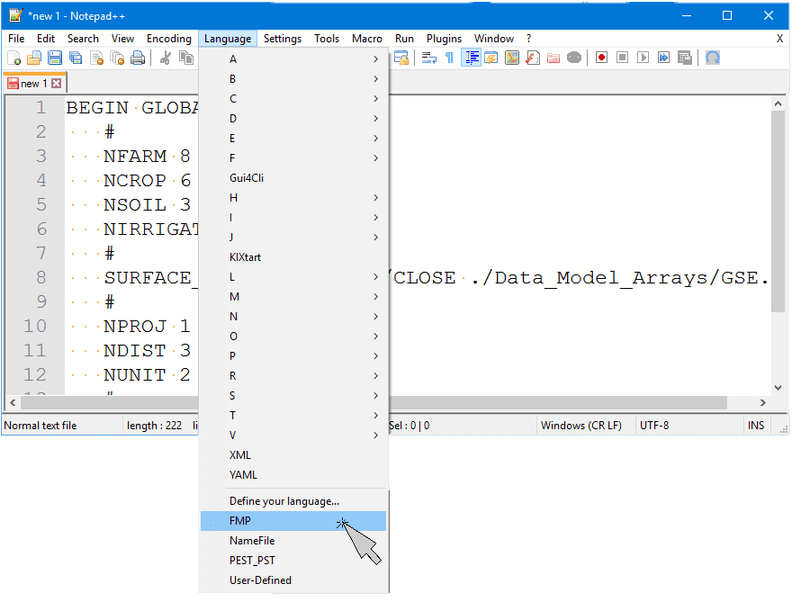
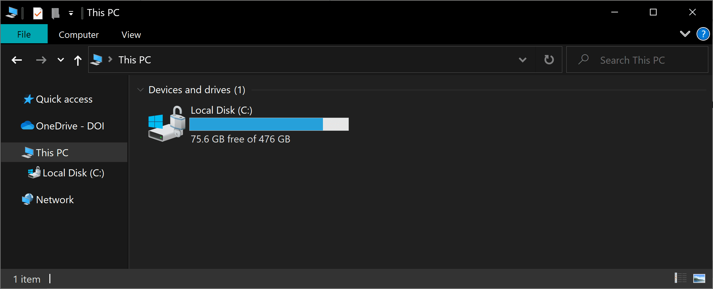
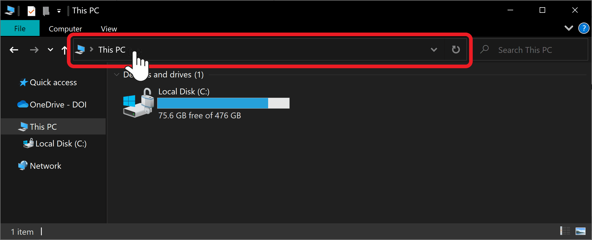
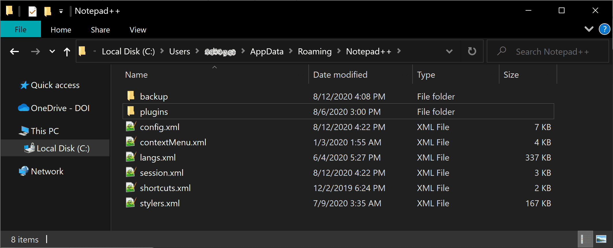
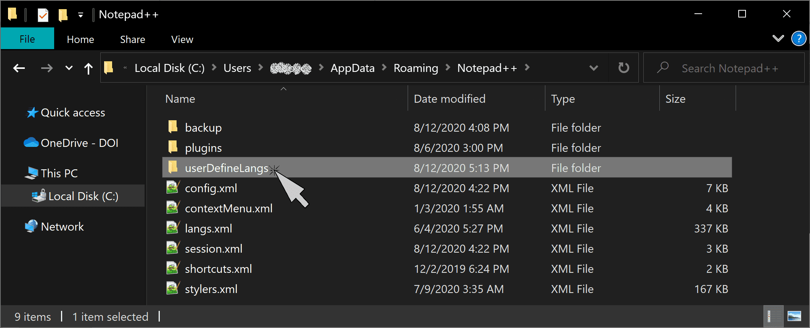
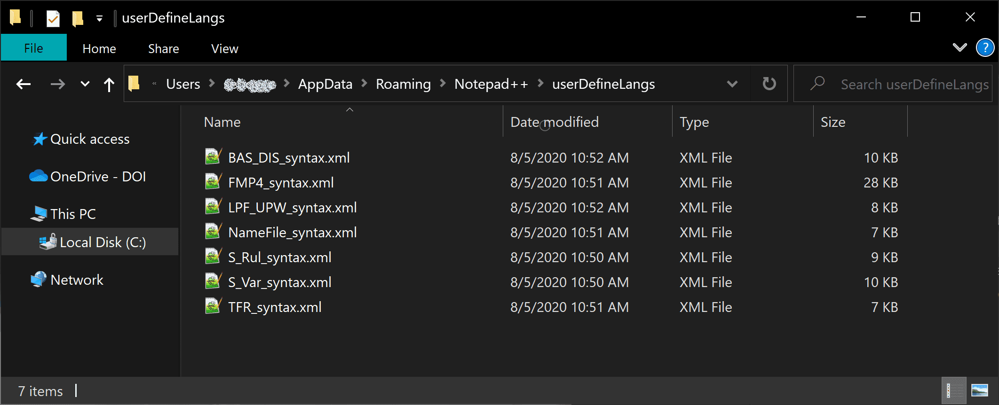
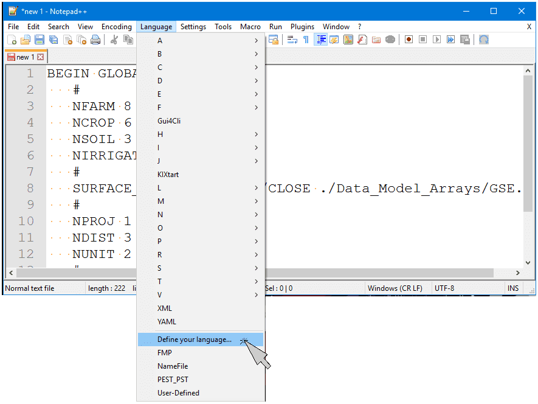
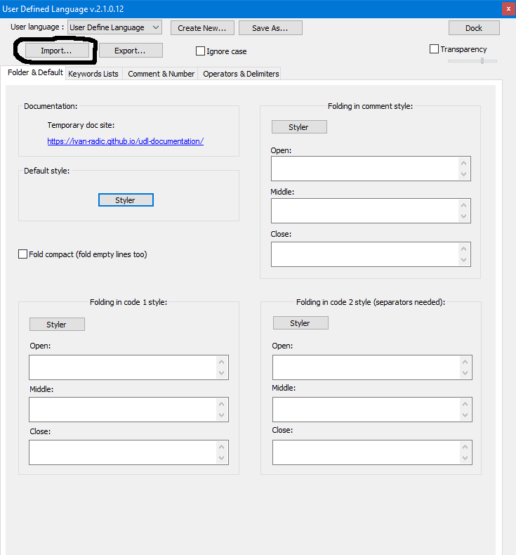
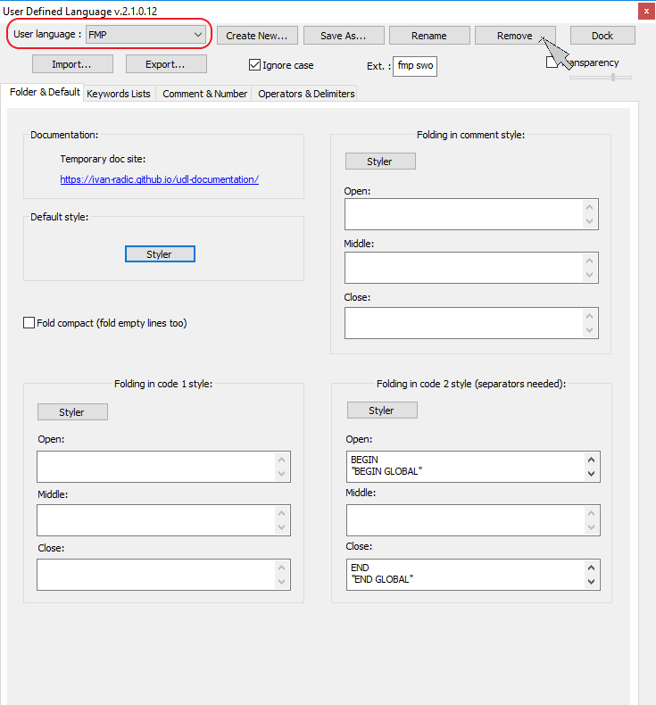

# MODFLOW Syntax Highlighting For Notepad++ 

&nbsp;

[[_TOC_]] 

&nbsp;

## Overview

&nbsp;

The document explains how to install the syntax highlighting support for MODFLOW-OWHM in the program [Notepad++](https://notepad-plus-plus.org/).

Syntax highlighting uses the file name or extension to determine the correctly highlighting scheme. 

For example the following would the Name File syntax highlighting:

- `Name.txt`
- `NAME.txt`
- `Name_File.nam`
    - `.nam` extension triggers syntax highlighting

And the following starts syntax highlighting for the Farm Process (FMP):
* `FMP.txt`
* `FMP_Input.fmp`
    * `.fmp` extension triggers syntax highlighting

&nbsp;

> :warning: If the syntax highlighting does not work, you can manually select it through the `Language` menu.  
> 
> For example, this is where to select the FMP syntax highlighting scheme, by going to the `Language` menu and selecting `FMP`.  
> 
> 

&nbsp;

## Extensions and Files Names Supported

The following are a listing of some of the Files/Packages that are supported and the expected extension for automatic highlighting.

&nbsp;

&nbsp;

| **XML File**         | **Extension and Filename**                                   | **Notes**                                                    |
| -------------------- | ------------------------------------------------------------ | ------------------------------------------------------------ |
| BAS-DIS.xml          | `.bas` `.dis` `BAS.txt` `DIS.txt`            | BAS and DIS input syntax                                     |
| FMP.xml              | `.fmp` `.fmp_well` `.fmp4` `FMP_Well.txt` `FMP.txt` | FMP input syntax                                             |
| GHB.xml              | `.ghb` `GHB.txt`                                        | GHB input syntax                                             |
| LIST.xml             | `.lst`                                                       | Disables syntax. Otherwise, Notepad++ thinks the file is Cobol source code. |
| MF-Flow-Packages.xml | `.lpf` `.upw` `.huf` `.bcf` `.bc6` `LPF.txt` `UPW.txt` `HUF.txt` `BCF.txt` | LPF, UPW, HUF, and BCF input syntax                          |
| MF-Packages.xml      | **See next table below**                                     | General syntax for MODFLOW-OWHM packages                     |
| MF-Solvers.xml       | `.de4` `.gmg ` `.pcg ` `.pcgn ` `.sip ` `DE.txt ` `DE4.txt ` `GMG.txt ` `PCG.txt ` `PCG2.txt ` `PCGN.txt ` `SIP.txt` | General syntax for MODFLOW-OWHM Solver packages              |
| MNW2.xml             | `.mnw ` `.mnw2 ` `MNW.txt ` `MNW2.txt ` `.mnwi ` `MNWI.txt` | MNW2 package syntax                                          |
| NameFile.xml         | `.nam ` `.name ` `Name.txt`                        | Name file syntax                                             |
| NWT-Solver.xml       | `.nwt ` `NWT.txt`                                       | NWT solver input syntax                                      |
| SFR.xml              | `.sfr ` `.sfr2 ` `SFR.txt`                         | SFR2 input syntax                                            |
| SUB.xml              | `.sub ` `SUB.txt`                                       | SUB input syntax                                             |
| OC.xml               | `.oc ` `OC.txt`                                         | Output Control syntax                                        |
| TFR.xml              | `.tfr`                                                       | Transient File Reader syntax                                 |

&nbsp;

------

&nbsp;

| MF-Packages.xml Supported Extensions |
| ------------------------------------ |
| `.ag`                                |
| `.bfh`                               |
| `.cfp`                               |
| `.chd`                               |
| `.chob`                              |
| `.coc`                               |
| `.crch`                              |
| `.de4`                               |
| `.drn`                               |
| `.drob`                              |
| `.drt`                               |
| `.drtob`                             |
| `.ets`                               |
| `.evt`                               |
| `.fhb`                               |
| `.gage`                              |
| `.gbob`                              |
| `.gwm`                               |
| `.hfb`                               |
| `.hob`                               |
| `.hyd`                               |
| `.ibs`                               |
| `.kdep`                              |
| `.lak`                               |
| `.lmt`                               |
| `.lvda`                              |
| `.mnw1`                              |
| `.mult`                              |
| `.obs`                               |
| `.pval`                              |
| `.rch`                               |
| `.res`                               |
| `.rip`                               |
| `.riv`                               |
| `.rvob`                              |
| `.str`                               |
| `.swi`                               |
| `.swr`                               |
| `.swt`                               |
| `.tab`                               |
| `.uzf`                               |
| `.wel `                              |
| `.well`                              |
| `.zon`                               |
| `.zone`                              |

&nbsp;

# Installing Syntax Highlighting

Syntax highlighting is available by installing an `xml` file that contains its description. 

The formal description for having the syntax installed within notepad++ is located here:

https://npp-user-manual.org/docs/user-defined-language-system/

If you are using a portable version of Notepad++, you should look up the instructions on installed languages there. More info is at: https://npp-user-manual.org/docs/user-defined-language-system/#udl-file-locations

There are two different methods to install the user syntax highlighting.  
The first method is the simplest but requires the user to be a bit tech savvy.  
The second method is the simplest to do but requires the most work.

&nbsp;

## Method 1 (Recommended) - Create a `userDefineLangs` directory

This is the simplest method that only involves moving the provided `userDefineLangs` directory to the `%AppData%\Notepad++\` directory. 

The easiest way to get to the Notepad++ settings directory is to open an explorer window.

&nbsp;

And click on the path bar to enter the directory location manually:

&nbsp;

&nbsp;

In the path bar to type  `%AppData%\Notepad++\` and press enter.

&nbsp;

&nbsp;

That will take you to the following directory. (Note that your user name will be in the place of the gray dots in the url bar).

&nbsp;

&nbsp;

This location needs a folder titled `userDefineLangs` for notepad++ to recognize syntax highlighting. This directory then holds all the xml files that define the syntax highlighting scheme.

&nbsp;

Now copy from the MF-OWHM repository all the xml files located in `doc/Notepadpp_Syntax_Highlighting/userDefineLangs` to this location.

&nbsp;

&nbsp;

Next time you start Notepad++, the language syntax will be automatically applied to any file opened with the recognized syntax.

&nbsp;

## Method 2  - Using the Notepad++ User Interface

To install locally the syntax highlighting you must import the syntax xml file to Notepad++

 The following are pictures showing how to do it:

1) Open Notepad++ (it does not matter what file you open or if it is empty)  
2) Go to Language > `Define Your Language…`

&nbsp;

&nbsp;

3) Then click import and select the xml syntax file to import.  
&emsp;&emsp;Select one of the xml files located in `doc/Notepadpp_Syntax_Highlighting/userDefineLangs`.

&nbsp;

&nbsp;

4) Next close the `User Defined Window` and  restart notepad++ itself.   
5) Now the syntax has been installed.  
&emsp;&emsp;If the extension is set to a known one (e.g. `FMP_input.fmp`) it will auto-highlight.  
&emsp;&emsp;Sometimes on the first load of the syntax, it will not work,   
&emsp;&emsp;and you must close the file tab and reopen it or manually enable the language

### Method 2 Side Note — `userDefineLang.xml`

If you import syntax using the Notepad++ User Interface it will add those files to a special file called `userDefineLang.xml` in the `%AppData%\Notepad++\` directory. This single file, `%AppData%\Notepad++\userDefineLang.xml`, holds all the syntax formatting rather than a set of files as described in Method 1.

If you look at the  `userDefineLang.xml` file you will notice that it just concatenated all the xml files that you imported into a single giant xml file.

## Side Note  — Deleting Duplicate Names

Sometimes if you re-install the syntax (because I sent a new version with updated keywords) it will show two copies of the same language (e.g. FMP appears twice). 

This typically happens when using Method 2.  When this occurs you have to go to `Language > Define Your Language` and select from the `User Language` pull down menu the duplicate you want deleted, then press `Remove`. This will delete the language definition.

 
