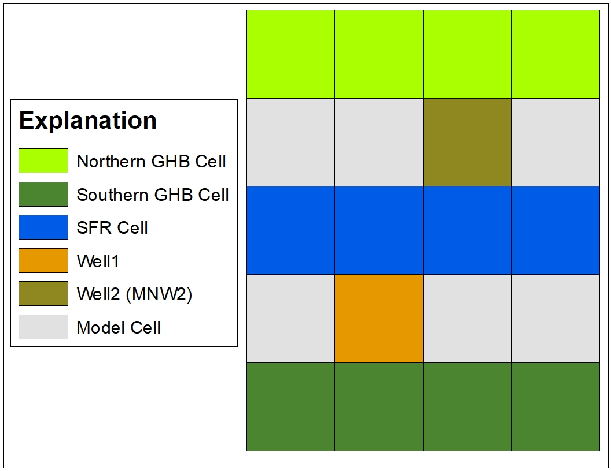

# MF-OWHM Example Problems

## by [Jon Traum](mailto:jtraum@usgs.gov) 

[(Jon Traum usgs profile)](https://www.usgs.gov/staff-profiles/jonathan-traum)

##### and edited by Scott Boyce

A major advantage of OWHM when compared to previous versions of MODFLOW is its ability to easily handle time series input datasets. The purpose of this example problem is to demonstrate how to use these powerful time series features in MF-OWHM. The example model is purposely very simple to focus on the use of these time series features. The example model setup can be used as a template for a more complex real-world model.


------

[[_TOC_]]     

------


## Example Model setup



The following list the characteristics of the example model:

- Model units are in `meters` and `days`
- The model has `5 rows`, `4 columns`, and `2 layers`.
- The cells are `100` m by `100` m by `50` m
- The model runs for `120` monthly stress periods
- The top of layer 1 has a constant altitude of `100` meters
- All model cells are active
- Starting head for all model cells is `90` m
- Both layers are convertible
- Horizonal hydraulic conductivity is `1` m/d in layer 1 and `0.5` m/d in layer 2
- Vertical hydraulic conductivity is `0.1` m/d in layer 1 and `0.05` m/d in layer 2
- Specific yield is `0.1` in both layers
- Specific storage is `10`<sup>-5</sup> m<sup>-1</sup> in both layers.
- The PCG solver with standard solver settings is used.

Not that most packages in MF-OWHM support comments that are preceded by a # symbol. When appropriate comments have been placed in the example input files.


## Step 1 - General Head Boundary (GHB)

​      In the directory `Model - 1 - GHB`, a general-head boundary package (GHB) is added to the model. Although the GHB is a standard package in previous versions of MODFLOW, MF-OWHM has enhanced the GHB package in order to easily handle time series input datasets through the TabFiles, Time Series Files, and the LineFeed input option. Separating out the time series (temporal) head data from the non-time series (spatial) parts of the GHB file make the file easier to construct. Also, if the head values need to be modified, the GHB does not need to be modified and only external files with time series data values need to be changed. These options are also included in other MF-OWHM packages and processes that are dependent on time series inputs including the Well (WEL), Multi-Node Well (MNW2), Drain Return (DRT), Streamflow-Routing (SFR), and Farm Process (FMP). This example model shows just one way to implement both `TABFILES` and `LINEFEED`, but there are many additional options beyond what is shown here. Modelers are encouraged to consult the [MF-OWHM report](https://pubs.er.usgs.gov/publication/tm6A60) appendices 1, 2, 3, and 6 for alternative input formats and options that may better fit their raw input data format. 

The `LINEFEED` option is utilized to simulate the northern boundary condition of the example model. This boundary condition is applied to model `layer 1`, `row 1`, `col 1, 2, 3, 4`, and the conductance is set to `500` m<sup>2</sup>/d. The boundary head for the GHB is time varying and spatially varying between the values of `73.5` m and `86.5` m. Using this `LINEFEED` option, the head and conductance values are specified in a FeedFile, which is located in `./feedfiles/GHBFeed_North.txt`. The values in the FeedFile are automatically added to `MXACTB`. In fact, the entire GHB input could be defined as FeedFiles, but a mixture of TabFiles and FeedFiles are used here for demonstration purposes. The example GHB also demonstrates the use scale factors (`SFAC`) with the `LINEFEED` alternative input. These factors globally scale the conductance and/or head values in the FeedFile and can be useful during model calibration.

The `TABFILE` option is utilized to simulate the southern boundary condition of the example model. This boundary condition is applied to `layer 1`, `row 5`, `col 1, 2, 3, 4`, and the conductance is set to  `500` m<sup>2</sup>/d. The boundary head for the GHB is time varying between the values of `63.5` m and `76.5` m. The head values are specified in a TabFile, which is located in `./tabfiles/GHBTAB_South.txt`. GHB cells associated with a TabFile must be declared in the normal input of the GHB, but are tagged with a TabFile `TABNAM` that tells MF-OWHM that the GHB `BHEAD` will be over-written by the TabFile value (Note that if a `TABNAM` is not found or matched to a TabFile, then the input as treated as a normal GHB cell). Since the BHead value will be over-written, a -999 is used as a dummy value. TabFiles have a variety of options, the ones used in this example are `IGNORE_TIME` and `SPBASIS` options are used, which instructs MF-OWHM to read from the TabFiles one value for each stress period. The `TABEQN` option tells MF-OWHM to check after the TabFile scale factor for an custom equation. This equation must be enclosed in single quotes and accepts the variables `TAB` for the TabFile value, `TIM` for the simulated time, and `REL` for decimal year of the time step. For example, `'5*(TAB/3 + SIM)'` will take the value returned from the TabFile for the time step and divide it by three, add the simulated time, and then multiply that sum by five. In this example, each column has a simple linear shift by having Col 1 added with `1.5` m, col 2 has `0.5` m added, col 3 has `0.5` m subtracted, and col 4 has `1.5` m subtracted. These equations can be useful in a real-world model if one well is used as a basis for determining the heads at several GHB cells, particularly if the GHB represents a freshwater equivalent head for an ocean boundary. The equations can also be useful in model calibration to scale the GHB heads.

The `Budget_Groups` block is utilized in the GHB package to split out the GHB_North and GHB_south. This  `Budget_Groups` block is a new feature in MF-OWHM that allows flows from single package to be split into different groups in the model output. In a real-world model, this feature could be used to easily separate GHB flows that should be presented separate fluxes, such as one GHB flows from different basins. In addition to the GHB package, the `Budget_Groups` option is available for the for the MNW2, RIP, WEL, DRN, DRT, and RIV packages.

To illustrate how output is different, the following shows volumetric budget from the LIST file without budget groups and then with them. Note that the GHB is specified as `HEAD DEP BOUNDS` and by specifying `Budget_Groups` it is changed to `GHB_NORTH` and `GHB_SOUTH`. 

```

  -------------------------------------------------------------------------------------
  VOLUMETRIC BUDGET FOR ENTIRE MODEL AT END OF TIME STEP    2 IN STRESS PERIOD    120
  -------------------------------------------------------------------------------------

     CUMULATIVE VOLUMES      L**3       RATES FOR THIS TIME STEP      L**3/T
     ------------------                 ------------------------

           IN:                                      IN:
           ---                                      ---
             STORAGE =     7929332.9434               STORAGE =        1416.0250
       CONSTANT HEAD =           0.0000         CONSTANT HEAD =           0.0000
     HEAD DEP BOUNDS =       71749.5891       HEAD DEP BOUNDS =           0.0000

            TOTAL IN =     8001082.5325              TOTAL IN =        1416.0250

          OUT:                                     OUT:
          ----                                     ----
             STORAGE =        6221.9211               STORAGE =           0.0000
       CONSTANT HEAD =           0.0000         CONSTANT HEAD =           0.0000
     HEAD DEP BOUNDS =     7994860.6150       HEAD DEP BOUNDS =        1416.0250

           TOTAL OUT =     8001082.5361             TOTAL OUT =        1416.0250

            IN - OUT =      -3.6343E-03              IN - OUT =      -6.8491E-07

 PERCENT DISCREPANCY =          -0.00     PERCENT DISCREPANCY =          -0.00


   TIME SUMMARY AT END OF TIME STEP     2 IN STRESS PERIOD    120    DATE: 2019-12-16 12:00:00  TO  2020-01-01 00:00:00

```

With budget groups specified:

```

  -------------------------------------------------------------------------------------
  VOLUMETRIC BUDGET FOR ENTIRE MODEL AT END OF TIME STEP    2 IN STRESS PERIOD    120
  -------------------------------------------------------------------------------------

     CUMULATIVE VOLUMES      L**3       RATES FOR THIS TIME STEP      L**3/T
     ------------------                 ------------------------

           IN:                                      IN:
           ---                                      ---
             STORAGE =     7929332.9434               STORAGE =        1416.0250
       CONSTANT HEAD =           0.0000         CONSTANT HEAD =           0.0000
           GHB_NORTH =       71749.5891             GHB_NORTH =           0.0000
           GHB_SOUTH =           0.0000             GHB_SOUTH =           0.0000

            TOTAL IN =     8001082.5325              TOTAL IN =        1416.0250

          OUT:                                     OUT:
          ----                                     ----
             STORAGE =        6221.9211               STORAGE =           0.0000
       CONSTANT HEAD =           0.0000         CONSTANT HEAD =           0.0000
           GHB_NORTH =     2250694.6556             GHB_NORTH =         285.3288
           GHB_SOUTH =     5744165.9594             GHB_SOUTH =        1130.6962

           TOTAL OUT =     8001082.5361             TOTAL OUT =        1416.0250

            IN - OUT =      -3.6343E-03              IN - OUT =      -6.8491E-07

 PERCENT DISCREPANCY =          -0.00     PERCENT DISCREPANCY =          -0.00


   TIME SUMMARY AT END OF TIME STEP     2 IN STRESS PERIOD    120    DATE: 2019-12-16 12:00:00  TO  2020-01-01 00:00:00
```


## Step 2 – FMP Wells and MNW2 Links

The purpose of this step is to demonstrate the setup of FMP farm-well input. Farm wells can be simulated as both simple wells (analogous to the WEL package) as well as linked wells with the MNW2 package (that is, FMP estimates the pumpage and sets the rate for a specified MNW2 well).  The FMP-MNW2 link allows simulating multilayered wells as well as using other advanced features from the MNW2 package.

In this step, the Farm process (FMP) is added to the model. However, besides the farm-well setup, the FMP setup is very simple with the following assumptions:

- Entire model is one water balance subregion (WBS, but commonly called a "farm")
- The the capillary fringe of the soil zone is set to `1` m for the entire model.
- The optional input for soil type is classified as `SILTYCLAY` for the entire model.
  - Note that, FMP supports four soil type categories:
    1. `SILT`
    2. `SILTYCLAY`
    3. `SANDYLOAM`
    4. `SAND`
- Precipitation is uniform for the entire model grid and held constant at `0.001` m/d 
- Reference Evapotranspiration (ET<sub>ref</sub>) is uniform for the entire model grid and held constant at `0.009` m/d
  - ET<sub>ref</sub> is used for estimating potential Evapotranspiration (ET<sub>pot</sub>) for land use types (commonly called crops). ET<sub>pot</sub> is an upper bound for actual consumption of water (ET<sub>act</sub>) by a land use type.
- Only 1 land use (crop) is defined and spans the entire model surface grid. Its properties are:
  - Crop coefficient (Kc) is `1.0`
  - Fraction of Transpiration (FTR) is `0.8`
    - FTR is ratio of Kc to Basal Crop Coefficient (Kcb)
    - Think of this as saying 80% of Kc is transpiration and 20% is evaporation
  - Receives irrigation if precipitation and natural root-uptake is insufficient to meet ET<sub>pot</sub>
    - Irrigation Efficiency is `70`%
    - Fraction of Evaporation of Irrigation (FEI) is `0.2`
      - That is 20% of excess irrigation is lost to evaporation
- Irrigation is supplied from two groundwater pumping wells
- The FMP-style runoff coefficient, called the fraction of inefficient loss to surface water, is specified for water that originated from precipitation (`SURFACEWATER_LOSS_FRACTION_PRECIPITATION`)  and irrigation (`SURFACEWATER_LOSS_FRACTION_IRRIGATION`).
  - `SURFACEWATER_LOSS_FRACTION_PRECIPITATION` is set to `0.5`
  - `SURFACEWATER_LOSS_FRACTION_IRRIGATION` is set to `0.5`
  - The SFR package is not specified, runoff does not have any stream location to flow to so FMP will have runoff flow out of the model.
    - The keyword `NORETURNFLOW` indicates that all surface runoff re-infiltrates to groundwater, which keeps the water within in the model.

The deficit crop water demand is satisfied by irrigation from two groundwater wells. `Well1` is located in `row 4`, `col 2` and is a single-layer (`layer 2`) well that is active for the entire model simulation period. `Well2` is located in `row 2`, `col 3` and is a multi-layer well that is only active from stress period 60 until the end of the simulation. `Wel2`'s construction properties are defined in the MNW2 package and linked to FMP. and has the following construction information:

- Loss function is set to `SKIN`
- Single screened interval
  - Top screen elevation is `60` m
  - Bottom screen  elevation is `10` m 
- The well outer radius (`Rskin`) is `0.2` m
- The well inner radius (`Rw`) is `0.1` m
- Hydraulic conductivity of the well skin material is `1.0` m/d

The FMP supply wells are input using the `TIME FRAME` option. FMP can load as many `TIME FRAME` files--one per line after the keyword-- but for simplicity only one file is opened. The one file that defines the FMP supply wells is `./data_fmp/fmp_well.txt`. Within this file, the `Date_Start` and `Date_End` are specified using stress period number, but calendar data could also be used. (Note that to use Calendar Date input in MF-OWHM, you must specify a model starting date with the BAS option `START_DATE`.) 

An FMP supply well is linked to MNW2 if its `Well_Name` matches the `WELLID` name of an MNW2 well and the FMP well's layer number is set to `0` or `MNW`. In this example, the layer number of `WEL2` is set to `MNW`, so FMP checks if there is a well named `WEL2` in MNW2 and FMP overrides the MNW2 `Qdes` pumping rate with the water supply that FMP needs. The FMP input also includes the `MNW_AUTOMATIC_ON` option, which lets FMP control when FMP-MNW linked wells are enabled--exist in the simulation--in MNW2. Otherwise the MNW2 input would have to specify the stress periods that correspond with the stress periods that FMP needs the well. What is confusing is that an MNW2 well that is enabled but has a `QDES=0` is simulated because there can be intraborehole flow, while if the well is not specified then it does not exist nor have any flow. A good way to view this, is that when the MNW2 well is first specified it represents when the well was drilled, and then when it is not specified, the well has been destroyed. FMP does include, but it is not used in this example, the option `MNW_AUTOMATIC_OFF`, which destroys the well when FMP no longer needs it. This is not recommended since in reality wells tend to be abandoned, rather than destroyed.

The `PRORATE_DEMAND ByCapacity` option is also utilized in the FMP, which distributes a WBS demand for well pumpage based on a ratio of each wells pumpage capacity to the total WBS pumpage capacity. For example, lets assume that the `Well1` and `Well2` can pump up to their maximum capacity (`QMAX`) that is specified in the FMP supply well input (`1.0e5` and `2.0e5` m<sup>3</sup>/d, respectively) , then `Well2` will pump twice as much as  `Well1`. Note that since `Well2` is linked to MNW2, the pumping capacity can be reduced due to well construction limitations or the current aquifer conditions (that is, MNW2 determines how much the well can actually pump).

## Step 3 – Surface Water Diversions

The purpose of this step is to demonstrate the setup of streamflow diversions to the farm process. The simulation of streamflow diversions has been greatly improved compared to previous versions of the farm process. In this version of MF-OWHM, diversions can be made from any segment/reach and a limit on the diversion can be specified. Previously, diversions could only be made at the end of stream segments, and it was not possible to apply a limit to the diversions; FMP would divert all water from the stream until either demand was met or the stream went dry. Thus, previous older MF-FMP models required a complex SFR, with many dummy segments, to properly simulate typically real-world surface water diversions.

The SFR is setup as follows:

- The stream network flows along `row 3` from `col 1` to `col 4`
- The streambed elevation decreases linearly from 95m (col1) to 92m (col4).
- Stream stage is simulated using manning equation (`ICALC=1`) assuming a steam width of `0.5` m and a roughness coefficient of `0.03`.
- Steam inflow at `row 3`, `col 1` is `25,000` m<sup>3</sup>/d for 6 months and `0` m<sup>3</sup>/d (no flow) for 6 months. 
  - The SFR inflow is specified using the LineFeed alternative input.
- An FMP semi-routed delivery diversion point is located at `row 3`, `col 3` (SFR `segment 1`, `reach 3`)
  - The diversion point has an upper delivery limit set to:
    1.  `3000` m<sup>3</sup>/d for 4 months,
    2. `1000` m<sup>3</sup>/d for 4 months, and 
    3. `0` m<sup>3</sup>/d for 4 months (this disables any deliveries from SFR).

The FMP surface water delivery location are read one and used for the entire simulation (`STATIC`) and is specified in `./data_fmp/fmp_srd_location.txt`. This example only has a single delivery location and specifies an upper limit for how much water FMP can remove from it (think of it as a diversion limit). The diversion limit is specified by stress period (`TRANSIENT`) in a transient file reader (`TFR`). A TFR is a file that contains either contains the actual stress period input or specifies the location of the stress period input. Each uncommented line contains a directive (such as, `OPEN/CLOSE` or `INTERNAL`) used by the universal loader (`ULOAD`). If no directive is specified, then the input is assumed to be specified directly on the line (called an *implied internal*). This example, specifies the TFR as `./data_fmp/fmp_srd_upper_limit.tfr` and since there is only a single delivery location uses *implied internal* to specify the single diversion upper limit per stress period.

FMP runoff can either leave the model, re-infiltrate to groundwater or flow to SFR segments. Now that SFR is enabled runoff can be set to flow to SFR segments. There are two methods to specify this, the first is to define the specific segments and the portion of runoff they receive, or FMP can spread runoff to all the SFR segments that reside within a WBS area. This example, uses the automatic option by specifying the keyword `ROUTED_RETURN_ANY_REACH`.