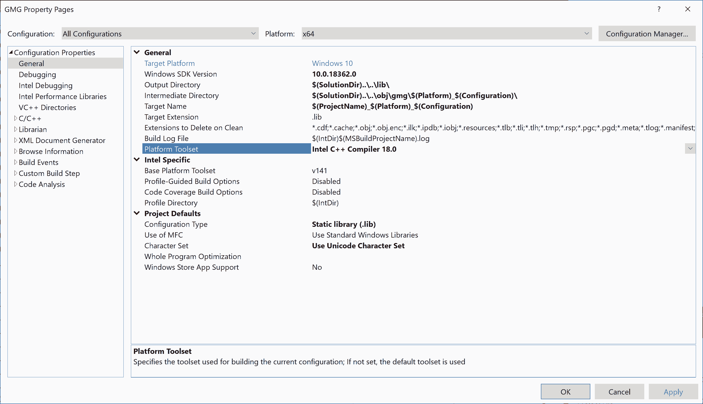
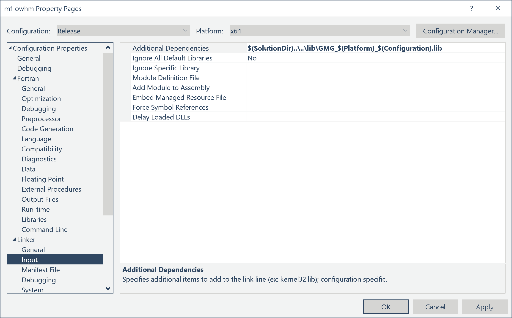
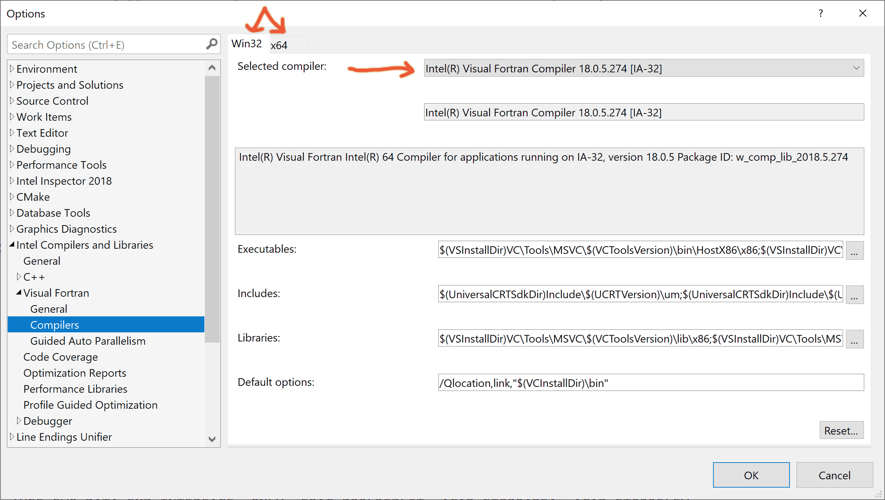

# Integrated Development Environment (IDE) 

To assist in compilation and development of source code a set of input files for different IDEs are provided. Note that the repository also incudes a `makefile` that is written in gnu make for compiling code directly (some of the IDEs use this makefile for their compilation process).

This folder contains a set of input files for using various IDEs to compile MF-OWHM, develop new features,  or to use the debugger for models with bad input data sets. If you wish to replicate the compiled binary in the official download, then you will need to use the Visual Studio solution with the Intel Fortran Classic compiler. For information on how to install this, please review [doc/Visual_Studio_and_Intel_Fortran_Installation_Guide.md](../doc/Visual_Studio_and_Intel_Fortran_Installation_Guide.md)

This directory is split into the following sub-directories

**Key Root Directory Names**

| Directory         | Description                                                  |
| ----------------- | ------------------------------------------------------------ |
| ide               | Integrated development environment (ide) files to assist with compiling.  The windows compiled executable uses Visual Studio 2019 Community Edition with Intel OneAPI Base and HPC Toolkits.  Other IDEs are provided as is, but have not been tested. |
| ide/visual_studio | [Visual Studio Community Edition](https://visualstudio.microsoft.com/) solution (`.sln`) and project files (`.vcxproj` and `.vfproj`) The IDE is setup using Intel Fortran Compiler Classic 2021.1.1 that is part of the Intel OneAPI. |
| ide/vscode        | Contains the file `mf-owhm.code-workspace` for loading the [vscode](https://code.visualstudio.com/) workspace properties  (which are specified in the `.vscode` folder). |
| img               | Images used in various readme.md and other md files.         |

## Visual Studio Project Information (`visual_studio` folder)

### Input File Description

The input to Visual Studio (VS) is composed of a *Project Solution* (`.sln`) and *Project Files* (eg `.vcxproj` and `.vfproj`). 

- The *Project Solution* file specify the location of the *project files*. 
- The *Project Files* contain a listing of the source files that are compiled in the project and compiler options.

VS uses the *Project Solution* file to open the *Project Files* to access the list of known source files for compilation.

### Fortran and C Project Solution

The first solution is the full installation of MF-OWHM, which includes both C and Fortran code. 

- `OneWater_GMG_Project.sln`
  --Full compilation of MF-OWHM, which includes the GMG Solver C-Library.

  1. `GMG.vcxproj`

     C project that builds the GMG library that is pre-configured.

     See [src/gmg_readme.md](../../src/gmg_readme.md) for instructions to remove GMG dependency (and thus not requiring a C compiler). This is already do for you if you use `OneWater_Project.sln`. 

  2. `mf-owhm-gmg.vfproj`

     Fortran project that depends on GMG.

     Contains all MODFLOW specific files.

If there is an issue with GMG as a dependency, it is recommend you check if your C compiler is set up correctly and that you reference it in the GMG project. That is go to the `GMG Property Pages`, then `General` and select the `Platform Toolset`. Another potential issue can be the `Windows SDK Version` might not match the version currently installed on your Windows machine. If not then, use the dropdown menu and pick the version that is specified (the menu will automatically list the available SDKs). 

Both `Platform Toolset` and `Windows SDK Version` are under the General menu in the following figure:

The name of the GMG library is under the `Output Directory` and `Target Name`, 
which also has to be specified as a dependency in the Fortran project:

--Note that this should already work by default.

### Fortran Only Project Solution

The second removes the C code and disables the `GMG` solver. The solvers `PCG`, `PCGN`, and `NWT` are still available.

- `OneWater_Project.sln`
  --MF-OWHM without GMG Solver.
  --This follows the directions from [src/gmg_readme.md](../../src/readme_gmg.md) to remove the C compiler requirement (only Fortran code).

  1. `mf-owhm.vfproj`

     Contains all MODFLOW specific files and the file `0_nogmg.f`.

## Changing Compilers

If you have multiple versions of Intel Visual Fortran installed you will have to pick one for the compilation. As discussed in the previous section, if you compile GMG then the version of Intel C should match the Intel Fortran. 

To change the compiler used for a compilation you have to go to the menu  `Tools` and select  `Options`, then in the Options menu go to `Intel Compilers and Libraries`. The next subheading to go to is the `Visual Fortran` then `Compilers` option and you should see the following:

The pull down menu to the right of Selected compiler: shows all the available versions of Fortran. Select the version you want to compile MODFLOW-OWHM with. 

1. Note that if you compile GMG, you will need to make sure the C compiler option matches the version of Fortran (see previous section). That is go to the `GMG Property Pages`, then `General` and select the `Platform Toolset`.
2. Note that this setting is global for all visual studio projects that are opened on that computer. So all projects opened on that computer will use the intel Fortran specified, but the `Platform Toolset` that specifies the C compiler is only for the project.